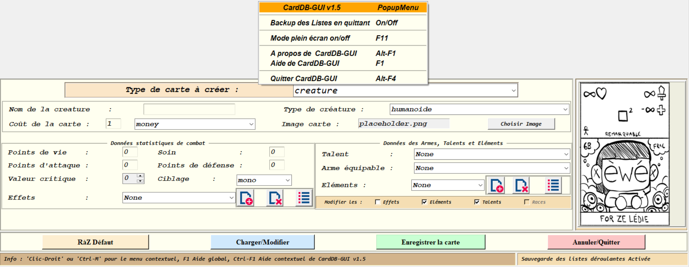

# CardDB - Système de Gestion de Cartes

<p align="center">
<strong>Une application Python complète pour la gestion et l'affichage de cartes de jeu collectibles</strong>

<strong> Sur une Idée originale de Doriqam Vidal  et  Lecurieux Stevens </strong>

<p/>

<p align="justify">
Le projet CardDB est une application de gestion de base de données de cartes collectibles développée en Python. Cette application offre une interface graphique intuitive pour consulter, modifier et gérer une collection complète de cartes de créatures, sorts et terrains.

</p>

## Description

### Vision du projet
CardDB est conçu pour offrir une gestion complète et flexible d'une base de données de cartes. L'application combine :

* 🎮 Un système d'archivage de cartes (créatures, sorts, terrains, équipements)
* 🎨 Une interface graphique pour visualiser et gérer les cartes
* 📊 Une structure de données hiérarchisée (armes, effets, éléments, races, talents)

### Fonctionnalités principales
* Gestion des **cartes de créatures** avec statistiques complètes
* Gestion des **cartes de sorts** avec effets et coûts
* Gestion des **cartes de terrain** affectant le gameplay
* Support des **cartes d'équipement** pour renforcer les unités
* **Interface graphique** pour une expérience utilisateur optimale
* **Base de données structurée** en JSON

## Structure

**Dossiers et fichiers principaux**

* `README.md` : Fichier de présentation du projet (vous y êtes !)
* `LICENSE` : Licence d'utilisation
* **src/** : Code source principal
  * `main.py` : Point d'entrée de l'application
  * `CardDB_GUI.py` : Interface graphique utilisateur
  * `Card.py` : Classe abstraite de base pour toutes les cartes
  * `CreatureCard.py` : Gestion des cartes de créatures
  * `SpellCard.py` : Gestion des cartes de sorts
  * `TerrainCard.py` : Gestion des cartes de terrains
  * `equipmentCard.py` : Gestion des cartes d'équipement
  * `cardLogics.py` : fonctions supplémentaires pour la logiques de jeu et interactions entre cartes tel que la lecture des règles
  * `CombatData.py` : Système de combat et résolution des affrontements
  * `test_card.py` : Tests unitaires pour les cartes
* **coreDataDB/** : Base de données thématique
  * `armes/` : Définitions des types d'armes
  * `elements/` : Définitions des éléments (feu, eau, terre, etc.)
  * `effets/` : Définitions des effets spéciaux
  * `monnaie/` : Système monétaire
  * `races/` : Types et caractéristiques des races
  * `sort/` : Catalogue des sorts
  * `talents/` : Talents disponibles pour les cartes
  * `testrule/` : Données de test et règles de jeu
* **cardsData/** : Exemples de cartes structurées
  * `creature_ewe.json` : Exemple de créature
  * `terrain_test0.json` : Exemple de terrain
* **imgsDataDB/** : Assets visuels
  * `cardImages/` : Images des cartes

## Technologies

* 
* 
* 

## Prérequis

**Langages et dépendances**

* Python 3.12 ou supérieur
* Tkinter (généralement inclus avec Python)
* Modules Python standard (json, os, sys, etc.)

## Utilisation

**Lancement de l'interface graphique**



les champs se remplissent via les cases associées

**Ajout de cartes**

Les cartes sont enregistré en format JSON dans le répertoire `cardsData/` selon l'exemple ci-dessous :
```json
{
  "name": "Ewe",
  "hp": 15,
  "atk": 10,
  "def": 0,
  "heal": 3,
  "currency": "money",
  "cost": 5,
  "talent": "increvable",
  "effects": [
    null
  ],
  "types": [
    "special"
  ],
  "crit": 8,
  "race": "magique",
  "weapon": "lourd",
  "targeting": "mono",
  "cardType": "creature",
  "imageFile": "././imgsDataDB\\cardImages\\placeholder.png"
}
```

## Architecture du système

### Hiérarchie des classes
- `Card` (classe abstraite) → `CreatureCard`, `SpellCard`, `TerrainCard`, `equipmentCard`
- Chaque type de carte possède ses propriétés spécifiques et sa logique d'interaction

### Système de données
- **coreDataDB** : Données de référence (armes, éléments, races, talents)
- **cardsData** : Instances de cartes utilisables dans le jeu
- **imgsDataDB** : Assets visuels associés aux cartes

## Développement

### Tests
Pour exécuter les tests unitaires :
```bash
python src/test_card.py
```

## Licence
Ce projet est sous licence [GNU General Public License v3.0](LICENSE).

## Utilisation d'IA Générative

l'IA n'a **pas été utilisé** pour écrire du code

Elle a été utilisée en assistance à la rédaction du ReadMe
